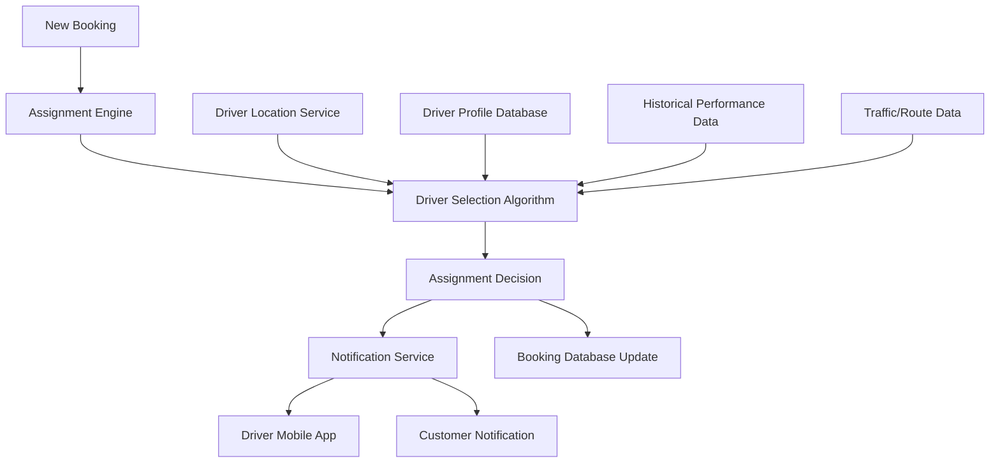

# Driver Assignment Algorithm Implementation Plan

## Overview
This document outlines the architecture and implementation plan for a driver assignment algorithm for FikaConnect. The algorithm will automatically match drivers to delivery requests based on multiple factors to optimize delivery efficiency, driver utilization, and customer satisfaction.

## Current System Analysis
Currently, the FikaConnect application marks new bookings as "Pending Driver Assignment" without an automated system to assign drivers. This requires manual intervention and doesn't optimize for efficiency.

## Goals and Requirements

### Primary Goals
1. Automatically assign the most suitable driver to each delivery request
2. Minimize delivery time and distance
3. Balance workload among drivers
4. Optimize for cost efficiency
5. Improve customer satisfaction through faster deliveries

### Functional Requirements
1. Match drivers to deliveries based on proximity, availability, and vehicle type
2. Consider driver workload to ensure fair distribution
3. Account for special delivery requirements (fragile items, weight, etc.)
4. Support batch processing for multiple deliveries
5. Allow manual override for special cases
6. Provide real-time updates on driver availability

### Non-Functional Requirements
1. Assignment decisions should be made within 5 seconds
2. System should handle at least 100 concurrent delivery requests
3. Algorithm should be adaptable to changing conditions
4. All assignment decisions should be logged for auditing and improvement

## Architecture Design

### High-Level Components



### Component Details

#### 1. Assignment Engine
- **Purpose**: Orchestrates the assignment process
- **Functions**:
  - Monitors new bookings
  - Triggers the driver selection algorithm
  - Handles assignment confirmations and rejections
  - Manages timeouts and fallbacks

#### 2. Driver Selection Algorithm
- **Purpose**: Core algorithm that selects the optimal driver
- **Algorithm Approach**: Weighted scoring system with the following factors:
  - Distance from driver to pickup location (40%)
  - Driver's current workload (20%)
  - Driver rating and performance history (15%)
  - Vehicle type suitability (15%)
  - Driver's working hours and preferences (10%)

#### 3. Driver Location Service
- **Purpose**: Tracks and provides real-time driver locations
- **Implementation**: Uses Firebase Realtime Database with geolocation queries

#### 4. Driver Profile Database
- **Purpose**: Stores driver information and preferences
- **Data Points**:
  - Vehicle type and capacity
  - Service areas
  - Working hours
  - Special capabilities (handling fragile items, etc.)

#### 5. Historical Performance Data
- **Purpose**: Provides insights on past performance for better matching
- **Metrics**:
  - Average delivery time
  - Customer ratings
  - Successful delivery rate
  - Punctuality

## Implementation Plan

### Phase 1: Basic Assignment Algorithm (2 weeks)

1. **Database Schema Updates**
   - Add driver availability status field
   - Create driver location tracking collection
   - Add assignment-related fields to bookings collection

2. **Core Algorithm Implementation**
   - Develop proximity-based matching logic
   - Implement basic workload balancing
   - Create Firebase Cloud Function for assignment processing

3. **Driver App Updates**
   - Add location sharing functionality
   - Implement assignment notification and acceptance UI
   - Create delivery queue view

### Phase 2: Advanced Features (3 weeks)

1. **Enhanced Algorithm**
   - Incorporate historical performance data
   - Add vehicle type matching logic
   - Implement time window considerations

2. **Batch Processing**
   - Develop logic for optimizing multiple assignments simultaneously
   - Implement route optimization for drivers with multiple deliveries

3. **Manual Override System**
   - Create admin interface for manual assignment
   - Implement override logging and tracking

### Phase 3: Optimization and Analytics (2 weeks)

1. **Performance Monitoring**
   - Implement assignment decision logging
   - Create dashboard for algorithm performance metrics

2. **Self-Improvement Mechanisms**
   - Develop feedback loop from delivery outcomes
   - Implement parameter auto-tuning based on performance

3. **Integration Testing**
   - End-to-end testing with simulated delivery scenarios
   - Load testing with concurrent assignment requests

## Technical Implementation Details

### Firebase Cloud Functions

```javascript
// Example Cloud Function for driver assignment
exports.assignDriverToBooking = functions.firestore
  .document('bookings/{bookingId}')
  .onUpdate(async (change, context) => {
    const bookingData = change.after.data();
    const bookingId = context.params.bookingId;
    
    // Only process if status is "Pending Driver Assignment"
    if (bookingData.status !== "Pending Driver Assignment") {
      return null;
    }
    
    try {
      // Get all available drivers
      const availableDriversSnapshot = await admin.firestore()
        .collection('drivers')
        .where('status', '==', 'available')
        .where('isActive', '==', true)
        .get();
      
      if (availableDriversSnapshot.empty) {
        console.log('No available drivers found');
        return null;
      }
      
      // Calculate scores for each driver
      const driverScores = await calculateDriverScores(
        availableDriversSnapshot.docs.map(doc => ({id: doc.id, ...doc.data()})),
        bookingData
      );
      
      // Select the driver with the highest score
      const selectedDriver = driverScores[0];
      
      // Update booking with assigned driver
      await admin.firestore().doc(`bookings/${bookingId}`).update({
        driverId: selectedDriver.driverId,
        driverName: selectedDriver.driverName,
        status: "Driver Assigned",
        assignmentTimestamp: admin.firestore.FieldValue.serverTimestamp()
      });
      
      // Update driver status
      await admin.firestore().doc(`drivers/${selectedDriver.driverId}`).update({
        status: 'assigned',
        currentBookingId: bookingId
      });
      
      // Send notification to driver
      await sendDriverNotification(selectedDriver.driverId, bookingId);
      
      console.log(`Driver ${selectedDriver.driverId} assigned to booking ${bookingId}`);
      return null;
    } catch (error) {
      console.error(`Error assigning driver to booking ${bookingId}:`, error);
      return null;
    }
  });

// Helper function to calculate scores for each driver
async function calculateDriverScores(drivers, booking) {
  const pickupLocation = new admin.firestore.GeoPoint(
    parseFloat(booking.pickupLocation.lat),
    parseFloat(booking.pickupLocation.lng)
  );
  
  // Calculate scores for each driver
  const scoredDrivers = await Promise.all(drivers.map(async driver => {
    // Calculate distance score (40%)
    const distanceScore = calculateDistanceScore(driver.currentLocation, pickupLocation);
    
    // Calculate workload score (20%)
    const workloadScore = calculateWorkloadScore(driver.completedDeliveries, driver.activeDeliveries);
    
    // Calculate rating score (15%)
    const ratingScore = calculateRatingScore(driver.rating);
    
    // Calculate vehicle suitability score (15%)
    const vehicleScore = calculateVehicleScore(driver.vehicleType, booking.parcelDetails);
    
    // Calculate availability score (10%)
    const availabilityScore = calculateAvailabilityScore(driver.workingHours);
    
    // Calculate total score
    const totalScore = (
      (distanceScore * 0.4) +
      (workloadScore * 0.2) +
      (ratingScore * 0.15) +
      (vehicleScore * 0.15) +
      (availabilityScore * 0.1)
    );
    
    return {
      driverId: driver.id,
      driverName: driver.name,
      totalScore,
      distanceScore,
      workloadScore,
      ratingScore,
      vehicleScore,
      availabilityScore
    };
  }));
  
  // Sort drivers by total score (highest first)
  return scoredDrivers.sort((a, b) => b.totalScore - a.totalScore);
}
```

### Database Schema Updates

#### Drivers Collection
```javascript
{
  "id": "driver123",
  "name": "John Doe",
  "contact": "+256712345678",
  "email": "john@example.com",
  "vehicleType": "motorcycle", // motorcycle, car, van, truck
  "vehicleCapacity": 50, // kg
  "rating": 4.8,
  "status": "available", // available, assigned, offline
  "isActive": true,
  "currentLocation": {
    "lat": 0.347596,
    "lng": 32.582520,
    "timestamp": "2025-07-28T09:30:00Z"
  },
  "workingHours": {
    "monday": {"start": "08:00", "end": "18:00"},
    "tuesday": {"start": "08:00", "end": "18:00"},
    // other days...
  },
  "serviceAreas": [
    {"name": "Kampala Central", "priority": 1},
    {"name": "Nakawa", "priority": 2}
    // other areas...
  ],
  "completedDeliveries": 128,
  "activeDeliveries": 0,
  "currentBookingId": null,
  "specialCapabilities": ["fragile", "refrigerated"]
}
```

#### Updated Bookings Collection
```javascript
{
  "id": "booking123",
  "customerId": "customer456",
  "customerName": "Jane Smith",
  "customerContact": "+256798765432",
  "deliveryType": "direct_delivery",
  "pickupLocation": {
    "name": "Kampala Road",
    "lat": 0.347596,
    "lng": 32.582520,
    "geopoint": GeoPoint(0.347596, 32.582520)
  },
  "dropoffLocation": {
    "name": "Entebbe Road",
    "lat": 0.300000,
    "lng": 32.500000,
    "geopoint": GeoPoint(0.300000, 32.500000)
  },
  "parcelDetails": {
    "type": "Electronics",
    "weightKg": 5.2,
    "isFragile": true
  },
  "recipient": {
    "name": "Bob Johnson",
    "contact": "+256712345678"
  },
  "fareAmount": 15000,
  "distanceKm": 12.5,
  "status": "Driver Assigned", // Updated from "Pending Driver Assignment"
  "paymentStatus": "Paid",
  "bookingDate": Timestamp,
  "driverId": "driver123", // New field
  "driverName": "John Doe", // New field
  "assignmentTimestamp": Timestamp, // New field
  "assignmentMethod": "automatic", // "automatic" or "manual"
  "estimatedDeliveryTime": Timestamp, // New field
  "actualDeliveryTime": null, // To be updated when delivered
  "assignmentScore": 85.2 // Score that led to this assignment
}
```

## Performance Metrics and Monitoring

To evaluate the effectiveness of the driver assignment algorithm, we'll track the following metrics:

1. **Average Assignment Time**: Time from booking creation to driver assignment
2. **Driver Acceptance Rate**: Percentage of assignments accepted by drivers
3. **Assignment Optimality**: Comparison of assigned driver to theoretical optimal driver
4. **Customer Satisfaction**: Ratings specifically for delivery time and driver
5. **Driver Utilization**: Balance of workload across all drivers
6. **Idle Time Reduction**: Decrease in driver waiting time between deliveries

## Rollout Strategy

1. **Alpha Testing** (1 week)
   - Test with a small subset of drivers (5-10)
   - Manual monitoring of all assignments
   - Gather feedback and make adjustments

2. **Beta Testing** (2 weeks)
   - Expand to 30-50% of drivers
   - A/B testing with manual assignments
   - Performance comparison and algorithm tuning

3. **Full Deployment** (1 week)
   - Gradual rollout to all drivers
   - Continued monitoring and optimization
   - Training for support staff on manual override procedures

## Future Enhancements

1. **Machine Learning Integration**
   - Train models on historical data to predict optimal assignments
   - Incorporate traffic prediction for more accurate ETAs
   - Personalized driver-customer matching based on past interactions

2. **Advanced Route Optimization**
   - Multi-stop route planning for drivers
   - Batched pickups and deliveries for efficiency
   - Dynamic rerouting based on real-time conditions

3. **Predictive Demand Modeling**
   - Forecast delivery demand by area and time
   - Pre-position drivers in high-demand areas
   - Optimize driver schedules based on predicted demand

## Conclusion

The driver assignment algorithm will transform FikaConnect's operations by automating a critical process, improving efficiency, and enhancing both driver and customer satisfaction. By implementing this system in phases, we can ensure a smooth transition while continuously improving the algorithm based on real-world performance data.